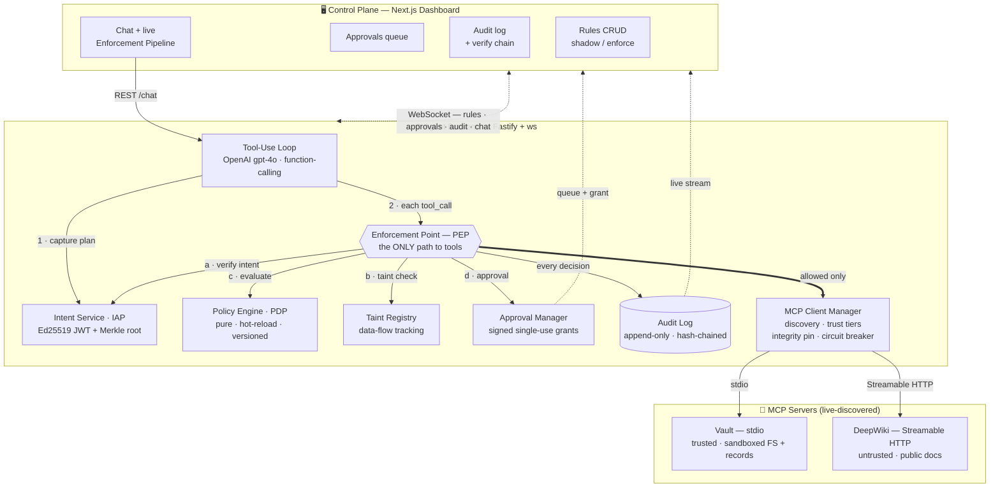
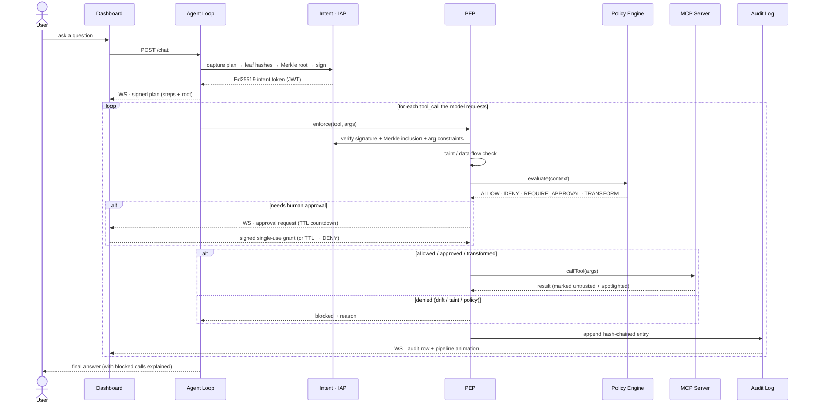
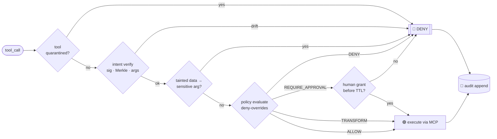
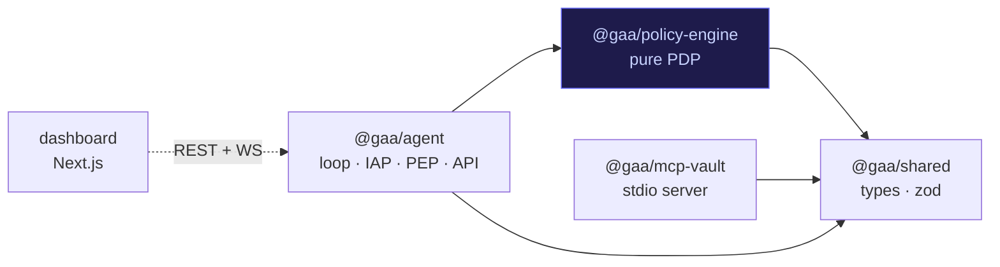

# Guarded AI Agent with MCP Support

An AI agent that talks to **MCP servers**, with a **policy layer that sits between the agent and
those servers** and enforces guardrails in real time. The guiding principle:

> **A tool call only runs if it provably belongs to a signed plan, came from trusted data, and
> passes live policy. Otherwise it is denied at the gate — fail-closed.**

Most "guarded agent" demos check a blocklist inline in the agent loop. This project instead treats
the **policy engine as the heart of the system** — a standalone, unit-tested decision point that the
agent loop merely enforces — and adds a cryptographic **intent layer**: the agent commits to a signed
plan before acting, and every tool call is verified against it, so a call that drifts from the plan
(the signature of a prompt-injection attack) is rejected.

---

## Highlights

- **Live tool discovery** across two transports — a custom **stdio** server and a remote **Streamable
  HTTP** server. No tool names are hardcoded anywhere; add a server to `mcp.config.json` and its
  tools appear automatically.
- **Policy engine as a separate module** (`packages/policy-engine`) with **zero** dependencies on the
  agent or MCP layers. Verdicts: `ALLOW / DENY / REQUIRE_APPROVAL / TRANSFORM`. Deterministic
  **deny-overrides + priority** conflict resolution. **Shadow (monitor) mode**. Content-addressed
  **policy versioning** stamped into every decision.
- **Cryptographic intent (mini Intent Assurance Plane):** the plan is committed as a **Merkle root**
  signed into an **Ed25519 JWT**; each call is checked for *signature + Merkle inclusion + argument
  constraints*. Catches "weaponized args" (right tool, malicious arguments), not just bad tool names.
- **Layered prompt-injection defense:** (1) tool-description **integrity pinning** (detects tool
  poisoning / rug-pulls), (2) **spotlighting + quarantine** of untrusted tool output, (3) **taint /
  data-flow** tracking (blocks untrusted data flowing into sensitive arguments), (4) **plan-drift**
  rejection (the structural backstop).
- **Live propagation:** rules created/toggled in the dashboard take effect on the next tool call via
  WebSocket — **no restart**.
- **Human approval done right:** signed, single-use, time-boxed grants bound to the exact call;
  approver offline ⇒ timeout ⇒ deny.
- **Tamper-evident audit log:** append-only, **hash-chained**, with a verify-chain action.
- **Live enforcement pipeline:** the dashboard animates every tool call as it walks the gate
  (`Request → Plan → Intent → Taint → Policy → Approval → Execute → Audit`) and lights up the stage
  that decided it — green allow, red deny, amber approval.
- **Fail-closed everywhere:** policy error, unreachable server, circuit-broken server, or expired
  approval all result in denial — never a silent allow.

---

## System architecture

The control plane (dashboard) and the data plane (agent backend) are separate processes that stay in
sync over a WebSocket. Inside the backend, the **Enforcement Point (PEP) is the only path to tools** —
nothing reaches an MCP server without first clearing intent, taint, and policy.



### Request lifecycle (user flow)

What happens end-to-end when a user sends one message — plan is signed first, then **every** tool
call is verified against that signature before anything runs.



### The enforcement gate (decision flow)

Inside `PEP.enforce`, checks run **in order and fail-closed** — the first stage to reject ends the
call. This is exactly what the dashboard's animated pipeline visualizes.



---

## Monorepo layout

| Path | What |
|------|------|
| `packages/shared` | Cross-cutting types & zod schemas (`Rule`, `Decision`, `AuditEntry`, `IntentToken`…) |
| `packages/policy-engine` | The PDP — pure, framework-free, unit-tested (the heart) |
| `packages/mcp-vault` | A custom MCP server: sandboxed file manager + record store + secrets |
| `packages/agent` | MCP client manager, intent layer, taint, enforcement, audit, approvals, tool-use loop, HTTP/WS API |
| `apps/dashboard` | Next.js guardrails console (rules, approvals, audit, chat, live pipeline) |
| `mcp.config.json` | Registry of MCP servers — add one here and the agent discovers its tools at runtime |



> Dependency arrows point **inward** to `shared`. The policy engine never imports the agent; the
> agent imports the policy engine. This keeps the decision logic pure and independently testable.

---

## Core pieces in depth

### Policy engine (PDP) — the heart
A pure, framework-free module with one entry point evaluated for **every** tool call:
`evaluate(ctx) → Decision`. Rules are **data, not code** (no tool name is ever hardcoded in logic):
each rule has a `match` predicate (tool glob, server/trust-tier, JSON-path/regex on args, taint flag,
risk threshold, budget) and an `action` (`deny / require_approval / allow / transform`). Conflicts
resolve by **priority + deny-overrides** (`DENY > REQUIRE_APPROVAL > TRANSFORM > ALLOW`),
deterministically, recording both the winning and losing rules so every outcome is explainable. The
active rule set hashes to a **`policyVersion`** stamped into every decision and audit entry. Rules
**hot-reload** — a dashboard edit governs the next tool call with no restart. Any throw or unreachable
store ⇒ **DENY** (fail-closed). A **shadow**-mode rule is evaluated and logged ("would have denied")
but does not block — test before you enforce.

### Intent Assurance Plane (IAP) — cryptographic intent
Before acting, the loop asks the model for a least-privilege **plan** of intended steps
`{ tool, argConstraints }`. Each step is canonicalized to a leaf hash `H(tool ‖ argConstraints)`; the
leaves form a **Merkle tree** whose root commits the whole plan. The root is signed into an
**Ed25519 JWT** (the "intent token"). Per call, the PEP verifies the **signature + expiry**, recomputes
the call's leaf and proves **Merkle inclusion** under the signed root, and checks the **actual args
satisfy the committed constraints**. Any failure ⇒ *plan drift* ⇒ DENY. Re-planning is allowed but
re-signs a new token and is logged — every action always traces to exactly one signed plan.

### Prompt-injection defense (defense in depth)
1. **Integrity pinning (TOFU):** hash each tool's name+description+schema on first discovery; re-hash
   on every `tools/list`; a mismatch quarantines the tool (rug-pull / tool poisoning) and raises an
   audit alert.
2. **Spotlighting + quarantine:** tool results are wrapped in explicit delimiters and labeled
   *untrusted data — never instructions*; the system prompt instructs the model accordingly.
3. **Taint / data-flow:** results from untrusted origins are tainted; if tainted content later appears
   in a sensitive tool's args, the injection rule denies it.
4. **Plan-drift (IAP):** injection's goal is deviation from intent — and drift is rejected at the gate.

### Resilience & fail-closed
Policy error/unreachable ⇒ DENY. MCP calls are wrapped with a **timeout** and surfaced to the model as
a *structured* tool error; a per-server **circuit breaker** opens after repeated failures and
short-circuits further calls; reconnect happens with backoff. A failed call is never reported as
success. A per-conversation **kill switch** freezes a conversation after N violations (assume
compromise) until an admin clears it.

### Provenance — tamper-evident audit
Append-only log; each entry embeds `prevHash`, so the chain is verifiable. Entry =
`{ ts, conversationId, tool, serverId, argsRedacted, taint, riskScore, verdict, matchedRuleId,
policyVersion, latencyMs, mode, prevHash, hash }`. The dashboard is a projection over this log; the
**Verify hash chain** action recomputes hashes to prove no tampering.

### Human approval — done right
Real-time queue over WebSocket. Approving issues a **signed, single-use, time-boxed grant** bound to
`(conversationId, tool, argHash)` — it cannot be replayed for a different call or different args.
Approver offline ⇒ TTL expiry ⇒ **DENY**.

---

## Getting started

Prerequisites: Node ≥ 20 and pnpm.

```bash
pnpm install
cp .env.example .env          # set OPENAI_API_KEY (model defaults to gpt-4o)

pnpm test                     # 29 tests across the policy engine, intent, audit, vault, and an
                              # end-to-end enforcement scenario (no LLM key required)

# Run the stack (two terminals):
pnpm agent                    # agent backend on :8787 (spawns the Vault MCP server itself)
pnpm dashboard                # dashboard on :3000
```

Then open <http://localhost:3000>. The dashboard connects to the agent at
`NEXT_PUBLIC_AGENT_URL` (default `http://localhost:8787`).

### Configuration

- `mcp.config.json` — the MCP servers. Ships with the local **Vault** (stdio, trusted) and the public
  remote **DeepWiki** server (HTTP, untrusted). Add another entry and it is discovered on boot.
- `.env` — `OPENAI_API_KEY`, `OPENAI_MODEL`, approval TTL, circuit-breaker thresholds, budget/kill
  switch limits, and optional Ed25519 signing keys (auto-generated if omitted). See `.env.example`.

---

## The Vault MCP server

A spec-compliant MCP server (`tools/list`, `tools/call`, JSON-Schema inputs, structured errors) over
stdio, exposing 7 tools: `list_files`, `read_file`, `write_file`, `query_records`, `fetch_updates`,
plus the deliberately dangerous `export_secret` and `delete_all` so the policy layer has real actions
to gate. Everything lives in a virtual `/sandbox` (no real disk access), with path-traversal
rejection.

It also ships two demo "traps":
- a seeded onboarding note containing an **indirect prompt-injection** payload, and
- a **rug-pull**: one tool's description mutates on re-listing, modelling tool poisoning — which the
  agent's integrity pinning detects and quarantines.

---

## How it answers the hard cases

- **MCP server crashes mid-call** — calls are wrapped with a timeout and surfaced to the model as a
  *structured* tool error; a per-server **circuit breaker** opens after repeated failures and
  short-circuits further calls; reconnect happens in the background. A failed call is never reported
  as success.
- **Prompt injection** — defense in depth: untrusted tool output is spotlighted and quarantined,
  tainted data cannot flow into sensitive arguments, and any call outside the **cryptographically
  signed plan** (or violating its argument constraints) is rejected. A successful injection still
  cannot grant capability the signed plan + policy didn't already allow.
- **Two rules conflict** — deterministic **deny-overrides** with a priority tiebreak; the winning and
  overridden rules are both recorded in the decision, so the outcome is explainable.
- **Approver offline** — approval requests have a TTL; on timeout the call is **denied** (fail-closed).
  Grants are signed, single-use, and bound to the exact call, so a stale approval can't be replayed.

---

## A 2-minute tour

1. Open the dashboard — see both MCP servers healthy, their tools discovered live, and the
   **Enforcement Pipeline** idle at the top.
2. **Chat:** "List the files under /sandbox/notes" → the agent plans, the plan is signed, the read is
   allowed, and a green packet runs the pipeline to **Execute** while the decision appears in the audit log.
3. **Block live:** the seed policy already blocks `vault.delete_all`; ask the agent to delete
   everything → the call drifts from the signed plan and is **denied** — the pipeline stops red at the
   **Intent** gate, no restart.
4. **Approval:** the seed policy requires approval for `vault.export_secret`; ask for the secret →
   the call pauses amber at the **Approval** gate. Approve it once; let the next one expire → denied.
5. **The trap:** "Summarize the onboarding note" → the note tries to hijack the agent into exporting a
   secret; the export is **outside the signed plan** and tainted → blocked, and the attempt is logged.
6. **Integrity:** click *Re-discover tools* → the rug-pulled tool is quarantined.
7. Click *Verify hash chain* on the audit log to confirm the trail is intact.

---

## Deployment

- **Local full stack (Docker):** `OPENAI_API_KEY=sk-... docker compose up --build` → dashboard on
  `:3000`, agent on `:8787`.
- **Backend** (`Dockerfile`) hosts well on Render / Railway / Fly. Set `OPENAI_API_KEY` and
  `CORS_ORIGIN` (your dashboard origin).
- **Dashboard** deploys to Vercel: set `NEXT_PUBLIC_AGENT_URL` to the deployed agent URL.

## Tech

TypeScript everywhere · pnpm workspaces · OpenAI (gpt-4o) function-calling · `@modelcontextprotocol/sdk`
· Fastify + ws · `jose` (Ed25519) · Next.js + Tailwind · Vitest.

## License

MIT
